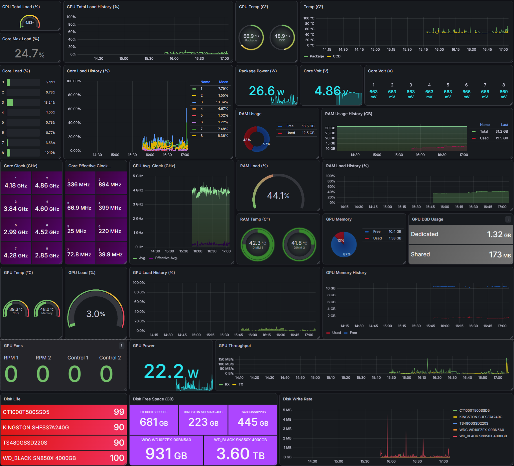

# lhm-textfile-exporter

A small Windows tool that scrapes [LibreHardwareMonitor](https://github.com/LibreHardwareMonitor/LibreHardwareMonitor)
and writes normalized Prometheus metrics for
[windows_exporter](https://github.com/prometheus-community/windows_exporter)'s textfile collector.

This is a **textfile writer**, not a Prometheus HTTP server. It does not expose `/metrics`.
`windows_exporter` (or another textfile collector) serves the file it produces.

```text
LibreHardwareMonitor -> lhm-textfile-exporter -> windows_exporter -> Prometheus -> Grafana
```

## What it does

- Scrapes LibreHardwareMonitor's Prometheus `/metrics` endpoint on a configurable interval
- Parses `lhm_*` series and groups them by hardware (`cpu`, `gpunvidia`, `storage`, …)
- Normalizes vendor-specific sensor names into stable `hardware_*` gauges
- Writes `textfile_inputs/hardware.prom` atomically (`# HELP` / `# TYPE`, Windows replace retry)
- Keeps the last successful hardware samples if LibreHardwareMonitor becomes unreachable
- Always writes exporter health metrics next to the hardware series
- Logs to the console and to `logs/exporter.log`

On first run it copies `config.default.yaml` to `config.yaml` (gitignored). Edit that file
and point `librehardwaremonitor.url` at your LibreHardwareMonitor `/metrics` URL.

## Hardware support

Validated on **AMD CPU + NVIDIA GPU + NVMe/SSD/HDD** (Windows).

| Exported | Not exported |
|---|---|
| AMD CPU (package, CCD, per-core) | Intel CPU |
| NVIDIA GPU | AMD GPU / iGPU |
| Motherboard fans, temperatures, voltages | Network |
| Memory (physical, virtual, DIMM temperatures) | Unknown / unmatched sensors |
| Storage (NVMe, SSD, HDD) | |

Unknown sensors are skipped (logged at `DEBUG`). The full LibreHardwareMonitor → `hardware_*`
mapping is in [docs/sensor-inventory.md](docs/sensor-inventory.md).

## Requirements

- Windows
- Python 3.10+
- [LibreHardwareMonitor](https://github.com/LibreHardwareMonitor/LibreHardwareMonitor) with the web server enabled
- [windows_exporter](https://github.com/prometheus-community/windows_exporter) with the textfile collector enabled

## Quick start

### 1. LibreHardwareMonitor

1. Run LibreHardwareMonitor (elevated is typical for full sensors).
2. Enable the web server.
3. Confirm metrics load, for example `http://127.0.0.1:8085/metrics`.
   You should see series named `lhm_cpu_*`, `lhm_gpunvidia_*`, and so on.

Leave LibreHardwareMonitor running. lhm-textfile-exporter only scrapes it.

### 2. Install and run

```powershell
git clone https://github.com/mishelest/lhm-textfile-exporter.git
cd lhm-textfile-exporter

python -m venv .venv
.\.venv\Scripts\Activate.ps1
pip install -r requirements.txt

python main.py
```

On first run, `config.yaml` is created from `config.default.yaml`. Set
`librehardwaremonitor.url` to your LibreHardwareMonitor `/metrics` URL, then restart.

You should see `textfile_inputs/hardware.prom` appear and update every scrape interval
(default 5s).

### 3. Point windows_exporter at the file

windows_exporter only reads `*.prom` files from its textfile directories
(default `C:\Program Files\windows_exporter\textfile_inputs`).

**Option A — keep the file in this repo** (no extra write permissions):

```text
windows_exporter.exe --collector.textfile.directories="C:\path\to\lhm-textfile-exporter\textfile_inputs"
```

**Option B — write into windows_exporter's default folder** (`config.yaml`):

```yaml
exporter:
  output_dir: "C:\\Program Files\\windows_exporter\\textfile_inputs"
  output_file: "hardware.prom"
```

That path usually needs an elevated process, or an ACL that lets your user write there.

Confirm the series on windows_exporter (default `http://127.0.0.1:9182/metrics`).
You should see `hardware_cpu_package_temperature_celsius` and `hardware_exporter_up`.

### 4. Scrape with Prometheus

Scrape windows_exporter as usual. Do **not** scrape lhm-textfile-exporter directly.

```yaml
scrape_configs:
  - job_name: windows
    static_configs:
      - targets: ["windows-host:9182"]
```

## Configuration

`config.yaml` (created on first run; not committed):

```yaml
librehardwaremonitor:
  url: "http://127.0.0.1:8085/metrics"

exporter:
  scrape_interval_seconds: 5
  output_dir: "textfile_inputs"
  output_file: "hardware.prom"

logging:
  level: "INFO"
  file: "logs/exporter.log"
```

| Key | Meaning |
|---|---|
| `librehardwaremonitor.url` | LibreHardwareMonitor Prometheus endpoint |
| `exporter.scrape_interval_seconds` | How often to scrape LibreHardwareMonitor |
| `exporter.output_dir` / `output_file` | Where the `.prom` file is written (relative to the repo, or absolute) |
| `logging.level` | Console and file log level (`DEBUG`, `INFO`, `WARNING`, `ERROR`, `CRITICAL`) |
| `logging.file` | Log path (created if missing) |

## Metrics

All series are gauges.

- Hardware: `hardware_*` — see [docs/sensor-inventory.md](docs/sensor-inventory.md)
- Health (always written):

| Metric | Meaning |
|---|---|
| `hardware_exporter_up` | `1` if the last LibreHardwareMonitor scrape succeeded, else `0` |
| `hardware_exporter_scrape_duration_seconds` | Last scrape attempt duration |
| `hardware_exporter_last_scrape_success_timestamp` | Unix time of last successful scrape |
| `hardware_exporter_scrape_errors_total` | Scrape errors since process start (gauge) |

On scrape failure, the file is still rewritten: last successful hardware samples (if any)
plus health with `up=0`. If there has never been a successful scrape, only health is written.

`hardware_exporter_scrape_errors_total` is a **gauge**, not a Prometheus counter — do not `rate()` it.

### Example PromQL

```promql
hardware_exporter_up

hardware_cpu_package_temperature_celsius
hardware_gpu_core_temperature_celsius

hardware_cpu_package_power_watts
hardware_gpu_power_watts

hardware_cpu_total_load_percent
hardware_gpu_core_load_percent
hardware_memory_load_percent

hardware_cpu_core_load_percent
hardware_storage_temperature_celsius
hardware_storage_life_percent
```

## Grafana

A Grafana dashboard is included in [`docs/grafana/lhm_dashboard.json`](docs/grafana/lhm_dashboard.json).

Import the JSON into Grafana and select the Prometheus data source that
scrapes your `windows_exporter` instance.

### Dashboard preview




## Layout

```text
lhm-textfile-exporter/
  main.py                 # entrypoint
  exporter_service.py     # scrape loop, logging, health
  config.default.yaml     # template copied to config.yaml
  src/
    config.py
    parser.py             # fetch + parse LibreHardwareMonitor Prometheus text
    classifier.py         # group by lhm_<group>_...
    normalizer.py         # sensors → hardware models
    models.py
    exporter/
      prometheus_exporter.py
  docs/
    sensor-inventory.md
    grafana/
      lhm_dashboard.json
      hardware_dashboard.png
```

## Limitations

- Windows only. Run from a terminal (`python main.py`); there is no Windows Service yet.
- No installer or PyPI package. Clone and run from source.
- Sensor matching is built for AMD CPU + NVIDIA GPU. Intel CPU and AMD GPU sensors are skipped.
- Network and other unmatched LibreHardwareMonitor groups are classified, then dropped.
- LibreHardwareMonitor must stay running with its web server enabled. This tool does not replace it.
- `hardware_exporter_scrape_errors_total` is a process-lifetime gauge; it resets when the process restarts.
- There is no log rotation yet.

## License

MIT. See [LICENSE](LICENSE).
